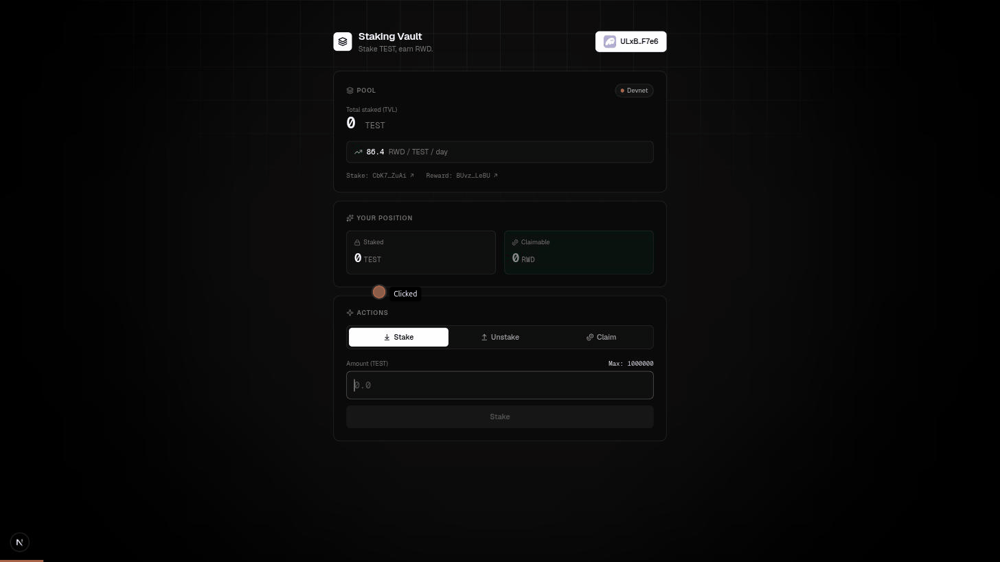
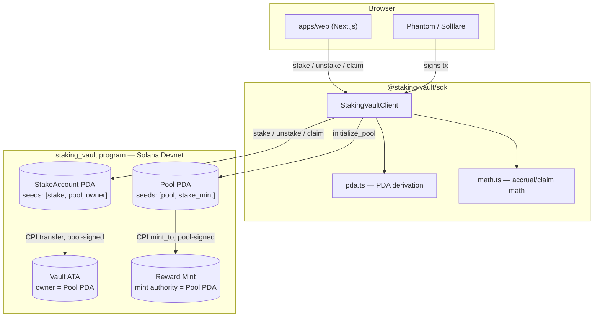
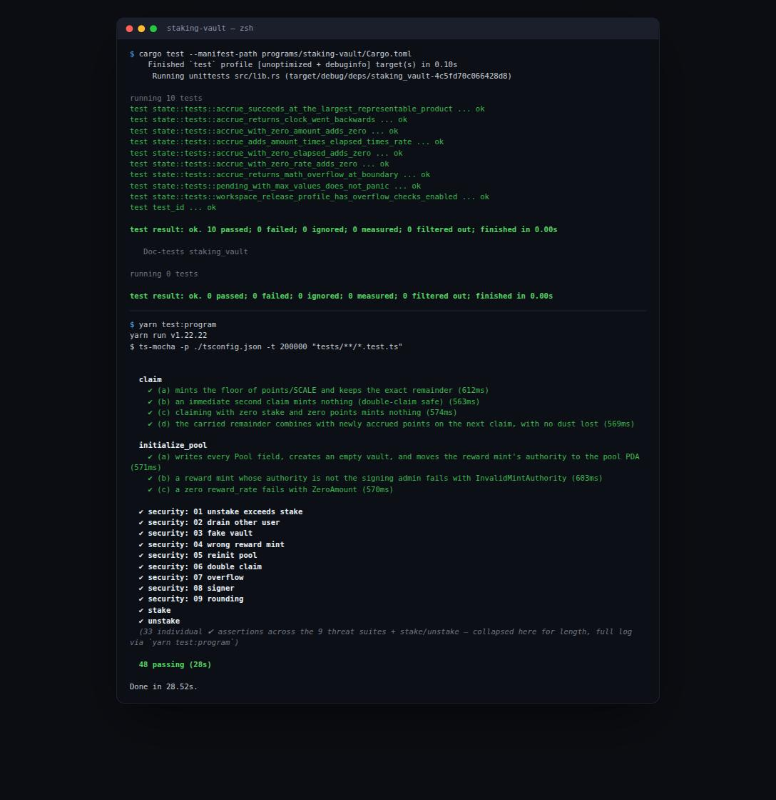

# staking-vault

[](https://github.com/SamarthShukla17/Staking-Vault/actions/workflows/ci.yml)

An Anchor-based SPL staking vault program on Solana, with a TypeScript SDK, web app, and supporting services to follow.

## Demo

Stake → claimable ticks up in real time (client-side, off the last-fetched account snapshot) →
claim → unstake, live against the deployed devnet pool:



## Architecture



The pool PDA is the sole authority over both the vault (stake token custody) and the reward mint
(mint authority) — the admin funds nothing and has no ongoing privileged control once
`initialize_pool` completes. See [SECURITY.md](SECURITY.md) for the full trust model.

## Toolchain

| Tool       | Version                                          |
| ---------- | ------------------------------------------------- |
| rustc      | 1.89.0 (29483883e 2025-08-04)                      |
| cargo      | 1.89.0 (c24e10642 2025-06-23)                      |
| solana-cli | 3.1.10 (src:7bc9c805; feat:1620780344, client:Agave) |
| anchor-cli | 1.1.2                                              |
| node       | v20.17.0                                           |
| yarn       | 1.22.22                                            |

## Monorepo layout

```
staking-vault/
├── programs/
│   └── staking-vault/   # Anchor program (lib name: staking_vault)
├── packages/            # TS SDK and shared packages
├── apps/                # Next.js web app
├── services/            # backend services
├── scripts/             # dev/ops scripts
├── docs/                # documentation
├── tests/               # program integration tests (ts-mocha)
├── Anchor.toml
├── Cargo.toml
└── package.json
```

## Quickstart

```bash
git clone https://github.com/SamarthShukla17/Staking-Vault.git
cd Staking-Vault
yarn install
anchor build
yarn test:program        # LiteSVM — no local validator needed, ~30s for all 48 tests
```

Run the web app against the live devnet pool:

```bash
cd apps/web
cp .env.example .env.local   # fill in NEXT_PUBLIC_* from docs/DEPLOYMENT.md
yarn dev
```

## Invariant

The property every instruction is built to preserve, checked at every instruction boundary and
re-asserted after every adversarial test in the security suite — not just that the specific
attack was rejected:

```
vault.amount == pool.total_staked == Σ stake.amount
```

The vault's real SPL token balance always exactly equals the sum of every individual position's
recorded `amount` for that pool, which always exactly equals `pool.total_staked`. Full threat
model and the defense for each of the 9 threats below: [SECURITY.md](SECURITY.md).

## Testing

Unit tests (program-internal accrual math) plus the full LiteSVM integration and 9-threat
security suite, run fresh against this commit:



```bash
cargo test --manifest-path programs/staking-vault/Cargo.toml   # 10 tests
yarn test:program                                                # 48 tests, ~30s
```

## Status

**Live on devnet:** [`9B6L1cQvonknPTnG1vjAAqRaFqeziM2EPw9ENqXnbDc6`](https://solana.fm/address/9B6L1cQvonknPTnG1vjAAqRaFqeziM2EPw9ENqXnbDc6?cluster=devnet-solana)

# Chapter 1 — Complete

 - Phase 1.1 Program core : Complete
 
     - 1.1 — Pool + StakeAccount structs
           (Goal: all on-chain state, errors, events, constants compile — data layer only.)
       
     - 1.2 — initialize_pool + LiteSVM test harness
           (Goal: pool creation works end-to-end and the TS test harness every later test reuses exists.)

     - 1.3 — stake with points accrual
           (Goal: tokens move user → vault, position opens or grows, accrual runs before every balance change.)

     - 1.4 — unstake with balance check
           (Goal: withdrawals via pool-signed CPI, impossible to withdraw more than staked.)

     - 1.5 — claim with reward minting
           (Goal: points convert to minted rewards, floor division, remainder retained.)


 - Phase 1.2 Security suite : Complete

     - 1.6 — Threat 1: unstake more than staked
     - 1.7 — Threat 2: drain another user's stake
     - 1.8 — Threat 3: fake vault substitution
     - 1.9 — Threat 4: wrong reward mint
     - 1.10 — Threat 5: pool re-initialization
     - 1.11 — Threat 6: double claim / claim without stake
     - 1.12 — Threat 7: arithmetic overflow
     - 1.13 — Threat 8: missing or wrong signer
     - 1.14 — Threat 9: rounding theft + SECURITY.md final
   


# Chapter 2 — Native Pinocchio Vault

A second, independent native program (`programs/pinocchio-vault`) implementing the same
staking protocol subset (init / stake / unstake) using [Pinocchio](https://github.com/anza-xyz/pinocchio) —
`no_std`, zero-copy, zero external dependencies.

## Why a native port?

- Binary ≈10× smaller than the Anchor version
- Compute-unit cost drops significantly (no Borsh, no framework overhead)
- Proves the protocol logic independent of any framework

## Building

```bash
bash scripts/build-pinocchio.sh
```

The Anchor program is unaffected — `anchor build` still works as before.

## Testing

```bash
cargo test --manifest-path programs/pinocchio-vault/Cargo.toml
```

## Layout (updated)

```
programs/
├── staking-vault/       # Anchor program (unchanged)
└── pinocchio-vault/     # Native Pinocchio program (new)
    ├── Cargo.toml       # standalone workspace
    └── src/
        └── lib.rs       # entrypoint + instruction dispatch
```